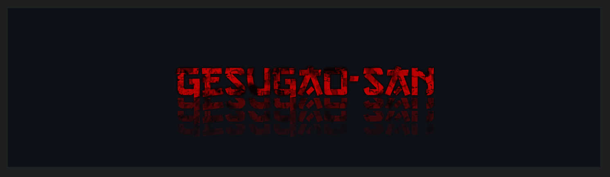
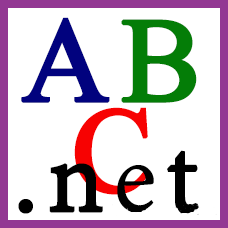
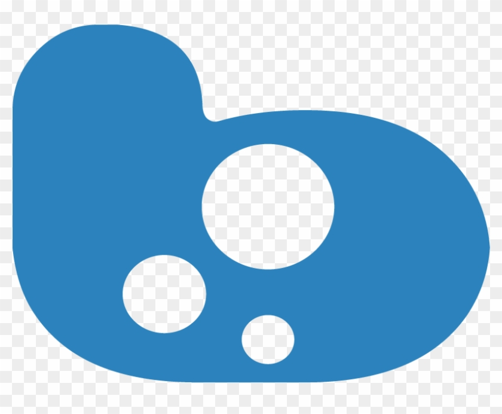
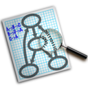

	

 <b>Hi!</b> My nickname is Gesugao-san, but you can just call me Gesu. 

 How did this nickname come about? One day I saw a <a href="https://youtu.be/uuBETyA_yxc">couple</a> <a href="https://youtu.be/nlzv-5XwatA">of</a> <a href="https://youtu.be/AgleELPY2As">videos</a> that I liked and I wanted to immortalize it. And "-san" is a respectful <a href="https://en.wikipedia.org/wiki/Japanese_honorifics#San">name prefix in Japanese</a>. Yes, it's that simple and unpretentious! While I can't say that my mood always matches those videos, I don't regret my choice.

<b>Coding is like <a href="https://tenor.com/view/12702119">magic</a></b> when you program reality to your needs and desires. Although this reality of computers and servers is not entirely real for living people of flesh and blood... but who said that the reality of programming is not more real than reality?

Unfortunately, studying has always been difficult for me - in the past I study under duress. It also affected my coding studies, but now, regular small wins over solving local problems increasingly make me feel pleasure and a sense of my own <a href="https://youtu.be/309QZhbLw8k">strength</a> and <a href="https://youtu.be/0H6kokpE_GQ">coolness</a>, which pushes me to self-educate and experiment, becoming more and more crazy over time.

My favorite programming language is <b>Node.JS</b> and Javascript in general, and I'm also fond of designing servers in <b>Discord</b> (and they also have an interesting <a href="https://discord.com/api/invite/123">API</a>).

I don't have a fixed schedule and I do my pet projects in my spare time. I can help with your projects if you're interested. On enthusiasm.

 On original language 

 <b>Привет!</b> Мой ник — Gesugao-san, но также я отзываюсь на "Гесу" или вообще "Гес". 

 Как этот никнейм появился? Однажды я увидел <a href="https://youtu.be/uuBETyA_yxc">пару</a> <a href="https://youtu.be/nlzv-5XwatA">интересных</a> <a href="https://youtu.be/AgleELPY2As">видео</a>, которые мне понравились, и мне захотелось увековечить это. А "-сан" - это уважительная <a href="https://ru.wikipedia.org/wiki/Именные_суффиксы_в_японском_языке#-сан">приставка к имени в Японском языке</a>. Да, вот так просто и незатейливо! Хоть я и не могу сказать, что моё настроение всегда подстать тем видео, я не жалею о выборе.

<b>Кодинг похож на <a href="https://tenor.com/view/12702119">магию</a></b>, когда ты программируешь реальность под свои нужды и желания. Хоть эта реальность компьютеров и серверов не совсем реальна для живых людей из плоти и крови... но кто сказал, что [реальность программирования не реальнее реальности](https://youtu.be/ZgeEQHYdDpo?t=1368)?

К сожалению, учёба всегда давалась мне тяжело - в прошлом я учится из-под палки. Это также сказалось на учёбе кодингу, но сейчас, регулярные небольшие победы над решением локальных задач всё чаще заставляют испытывать удовольствие и ощущение собственной <a href="https://youtu.be/309QZhbLw8k">силы</a> и <a href="https://youtu.be/0H6kokpE_GQ">крутости</a>, что поддталкивает меня на самообразование и эксперименты, становящиеся со временем всё более и более безумными.

Мой любимый язык программирования - <b>Node.JS</b> и Javascript в целом, а также увлекаюсь оформлением серверов в <b>Discord</b> (а ещё у них интересный <a href="https://discord.com/api/invite/123">API</a>).

У меня нет чёткого расписания, и я делаю свои пет-проектики в свободное время. Могу помочь с твоим проектами, если заинтересуешь. На энтузиазме. 

<!-- <table border="0">
	<caption></caption>
	<tr>
		<th>
		<a href="https://youtu.be/0H6kokpE_GQ" title="Music Caster Video Demo">
		

			
		

		</th>
		<th>
		<a href="https://youtu.be/309QZhbLw8k" title="Music Caster Video Demo">
		

			
		

		</th>
	</tr>
</table> -->

<!-- 

	

		Greetings protocol
	

<blockquote>

 English 
<blockquote>

</blockquote>

 Russian (Русский) 
<blockquote>

</blockquote>

</blockquote>
 -->

---

<!-- 

	
	</a>
	
	</a>

 -->

<h3> My Pet Projects </h3>

	<ul>
		<li><a href="https://wikipedia.org/wiki/Space_Station_13">Space Station 13</a>: <a href="https://github.com/Gesugao-san/SS13-Codebases#readme">SS13 Codebases</a>, <a href="https://github.com/ss13-sigma-dev/sigma#readme">SS13 Sigma</a> (both projects are abandoned)</li>
		<li><a href="https://www.pcgamingwiki.com/">PCGamingWiki</a>: <a href="https://github.com/Gesugao-san/pcgw-crawler">pcgw-crawler</a></li>
		<li><a href="https://wikipedia.org/wiki/Windows_10">Windows 10</a>: <a href="https://github.com/Gesugao-san/win_autorepair">win_autorepair</a>, <a href="https://github.com/Gesugao-san/list_remotes">list_remotes</a>, <a href="https://github.com/Gesugao-san/SDI_scripts">SDI_scripts</a></li>
		<li>More: *(exist but todo to write down here)*</li>
	</ul>

### List of technologies

	<table border="0">
		<caption></caption>
		<tr>
			<th>
				Category
			</th>
			<th>
				<ruby>
					<rb> Name of technology </rb>
					<rt> (clickable + <a href="https://archive.org/web/">Wayback Machine</a> saved) </rt>
				</ruby>
			</th>
		</tr>
		<tr>
			<td><li>Langs: </li></td>
			<td>
				
				
				
				
				
			</td>
		</tr>
		<tr>
			<td><li>↑ (specific): </li></td>
			<td>
				
				
				<ruby>
					<rb>
						
					</rb>
					<rt> (Dream Maker) </rt>
				</ruby>
			</td>
		</tr>
		<tr>
			<td><li>Web: </li></td>
			<td>
				
				
				
			</td>
		</tr>
		<tr>
			<td><li>OS: </li></td>
			<td>
				
				
			</td>
		</tr>
		<tr>
			<td><li>IDE: </li></td>
			<td>
				
			</td>
		</tr>
		<tr>
			<td><li>Social: </li></td>
			<td>
				
				
				
			</td>
		</tr>
		<tr>
			<td><li>Graphs&charts: </li></td>
			<td>
				Evolving:
				<ruby>
					<rb>
						
					</rb>
					<rt><a href="http://go.bubbl.us/7932d6/2003?/ПП/"> (between 2016 and 2017) </a></rt>
				</ruby>
				→
				<ruby>
					<rb>
						
					</rb>
					<rt> (1 private, ~2020) </rt>
				</ruby>
				→
				<ruby>
					<rb>
						
					</rb>
					<rt><a href="https://github.com/Gesugao-san/SS13-Codebases/"> (about June of 2021) </a></rt>
				</ruby>
				 
				To review:
				<a href="https://www.diagrams.net/">
				<!--  -->
				</a>
				,
				,
				<a href="https://vega.github.io/vega/examples/tree-layout/">
				Vega
				</a>.
				 
				<li>askubuntu <a href="https://askubuntu.com/q/16388/"><small>(q16388)</small></a> list: </li>
				<a href="https://cacoo.com/">Cacoo</a>, <a href="https://www.networkmaps.org/">NetworkMaps <small>(old MaSSHandra)</small></a>, <a href="https://www.gliffy.com/">Gliffy</a>, <a href="https://creately.com/">Creately</a>.
				<li>others list: </li>
				<a href="https://www.lucidchart.com/pages/">Lucidchart</a>, <a href="https://drawio-app.com/">DrawIO</a>.
			</td>
		</tr>
		<tr>
			<td><li>Others: </li></td>
			<td>
				
				</a>
				
			</td>
		</tr>
	</table>

---

---

  

See also: <a href="https://wakatime.com/@GesugaoSan">Wakatime</a>, <a href="https://profile-summary-for-github.com/user/Gesugao-san">Profile-summary-for-github</a>

[SS13 Codebases]: https://github.com/Gesugao-san/SS13-Codebases#readme
[SS13 Sigma]: https://github.com/ss13-sigma-dev/sigma#readme

<!--
**Gesugao-san/Gesugao-san** is a ✨ _special_ ✨ repository because its `README.md` (this file) appears on your GitHub profile.

Here are some ideas to get you started:

- 🔭 I’m currently working on ...
- 🌱 I’m currently learning ...
- 👯 I’m looking to collaborate on ...
- 🤔 I’m looking for help with ...
- 💬 Ask me about ...
- 📫 How to reach me: ...
- 😄 Pronouns: ...
- ⚡ Fun fact: ...
-->
