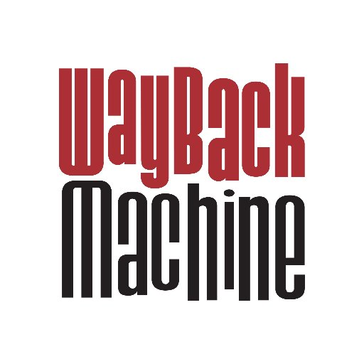

	

	

		Greetings protocol
	

<blockquote>

 English 
<blockquote>

</blockquote>

 Russian (Русский) 
<blockquote>

</blockquote>

</blockquote>

---

  <!--
  
  </a>
  -->
  
  </a>

### Projects

* Space Station 13: [SS13 Codebases], [SS13 Sigma] \(old\)
* More: *(exist but todo to write down here)*

# List of technologies

<table border="0">
    <caption></caption>
	<tr>
		<th>
			Category
		</th>
		<th>
			<ruby>
				<rb> Name of technology </rb>
				<rt> (clickable + <a href="https://archive.org/web/">Wayback Machine</a> saved) </rt>
			</ruby>
		</th>
	</tr>
	<tr>
		<td><li>Langs: </li></td>
		<td>
			
			
			
			
			
		</td>
	</tr>
	<tr>
		<td><li>↑ (specific): </li></td>
		<td>
			
			
			<ruby>
				<rb>
					
				</rb>
				<rt> (Dream Maker) </rt>
			</ruby>
		</td>
	</tr>
	<tr>
		<td><li>Web: </li></td>
		<td>
			
			
			
		</td>
	</tr>
	<tr>
		<td><li>OS: </li></td>
		<td>
			
			
		</td>
	</tr>
	<tr>
		<td><li>IDE: </li></td>
		<td>
			
		</td>
	</tr>
	<tr>
		<td><li>Social: </li></td>
		<td>
			
			
			
		</td>
	</tr>
	<tr>
		<td><li>Graphs&charts: </li></td>
		<td>
			Evolving:
			<ruby>
				<rb>
					
				</rb>
				<rt><a href="http://go.bubbl.us/7932d6/2003?/ПП/"> (between 2016 and 2017) </a></rt>
			</ruby>
			<ruby>
				<rb>
					→
				</rb>
				<rt> (big pause) </rt>
			</ruby>
			<ruby>
				<rb>
					
				</rb>
				<rt><a href="https://github.com/Gesugao-san/SS13-Codebases/"> (June of 2021) </a></rt>
			</ruby>
			 
			To review:
			<a href="https://www.diagrams.net/">.DrawIO <small>(old Jgraph)</small></a>,
			<a href="https://www.yworks.com/products/yed/">yED Graph Editor</a>.
			 
			<li>askubuntu <a href="https://askubuntu.com/q/16388/"><small>(q16388)</small></a> list: </li>
			<a href="https://cacoo.com/">Cacoo</a>, <a href="https://www.networkmaps.org/">NetworkMaps <small>(old MaSSHandra)</small></a>, <a href="https://www.gliffy.com/">Gliffy</a>, <a href="https://creately.com/">Creately</a>.
		</td>
	</tr>
	<tr>
		<td><li>Others: </li></td>
		<td>
			
			</a>
			
		</td>
	</tr>
</table>

---

[SS13 Codebases]: https://github.com/Gesugao-san/SS13-Codebases#readme
[SS13 Sigma]: https://github.com/ss13-sigma-dev/sigma#readme

<!--
**Gesugao-san/Gesugao-san** is a ✨ _special_ ✨ repository because its `README.md` (this file) appears on your GitHub profile.

Here are some ideas to get you started:

- 🔭 I’m currently working on ...
- 🌱 I’m currently learning ...
- 👯 I’m looking to collaborate on ...
- 🤔 I’m looking for help with ...
- 💬 Ask me about ...
- 📫 How to reach me: ...
- 😄 Pronouns: ...
- ⚡ Fun fact: ...
-->
